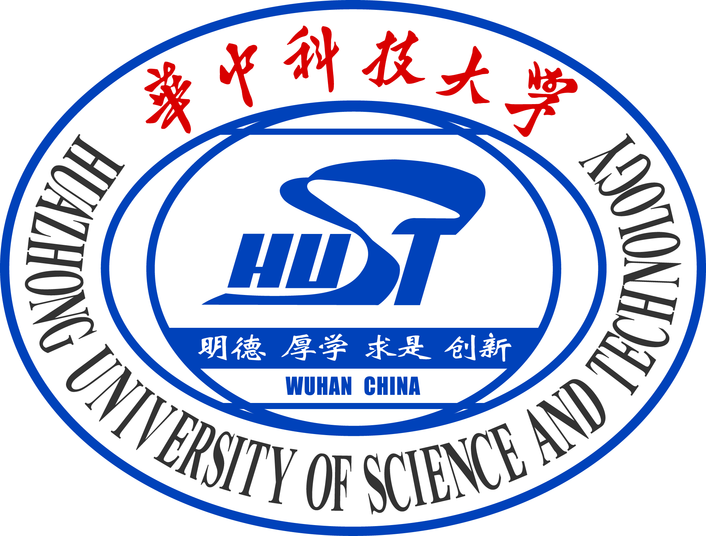

<figure markdown>
  { width="400" }
</figure>

# 前言

又到了一年开学季，转眼间我也大三了。说起来蛮惭愧，没有取得太大的成就。当年我也是想着卷好加权，搞好科研，平步青云的理想主义者，现在也是被生活磨灭了呀哈哈哈

正如我在**2025.9.3凌晨**写的招募稿所说，创建这个计划的初心非常纯粹，除了驱逐某资料的考量外，本心是很遗憾的看到，华科的评价体系较为**狭窄**。我看到能力很强的同学，考试却因为不知道考啥考不到理所应当的分数，也很无奈，像我这种能力很差，却总能靠刷题刷到一个分数；也很遗憾地看到，在本科教育全面崩塌的时代环境（[上海交通大学生存手册](https://github.com/SurviveSJTU/SurviveSJTUManual/blob/master/SUMMARY.md)）下，多少人因为一次考试折磨的痛不欲生，最让我感到伤感的是世界上有山河冰川，我们却在为着绩点感怀忧伤。

可是事情本来不应该是这样的呀，我一直坚信，每个人有不同的选择，你可以选择卷，靠着赏心悦目的GPA去往更高的平台;也可以选择就业提升自己的能力打拼青春;也可以选择放置学习，趁着青春做自己想做的事情

但在大部分学校，都存在一个很严重的问题：没有像样的资料流传

这里除了打压某资料的考量，还有众多参考资料集中的考量。就计算机学院来说，**在国外课程里面习以为常的课程主页设计，在华科几乎没有，对于过往实验指导的内容也几乎为零。最重要的，是学校的内容我们不得不去做，但是往往和学术，工作和理想脱节**

所以，本心很简单：**为大家集中资源用更少的时间去做自己想做的事情**

# 额外单独说一句

如果同学你是在宿舍游戏人生，荒废青春，只是希望来点资料快速及格而不是为了更好的自己，我希望能着重思考多番询问，这真的是想要的结果吗？

# 特别鸣谢

在这里，我怀着崇敬之心真诚地感谢每一个支持开源计划，同时提出维护网站并且提供资料链接的各位，（默默嘀嘀咕咕先感谢感谢我靠北这么快网暴就到了）[Francis_Chen](https://github.com/YuhangChen1),[Sukuna](https://github.com/SukunaShinmyoumaru-hust)，[Ilosyi](https://github.com/Ilosyi),[Alumkal](https://github.com/alumkal),[Amoxcillinia](https://github.com/Amoxcillinia),[Nuyoahwjl](https://github.com/Nuyoahwjl)
后续有任何提交内容的，请联系我，并加入鸣谢

**课程推荐**栏目由计算机学院[Amoxcillinia](https://github.com/Amoxcillinia)特约推荐

# 最后请求

请给每一个资料链接对象的仓库一个小小的 ⭐ **star** ⭐

## 许可协议

本站所有原创内容及汇编资料，除特别声明外，均采用 [知识共享署名-非商业性使用 4.0 国际 (CC BY-NC 4.0)](https://creativecommons.org/licenses/by-nc/4.0/deed.zh-Hans) 许可协议进行授权。

我们欢迎您自由地分享和传播本站资源，但请务必保留出处。我们创建此站的初心是互助共享，而非盈利，因此严禁将本站任何内容用于商业目的。

希望这里的资料能帮助你节省时间，去做更想做的事。