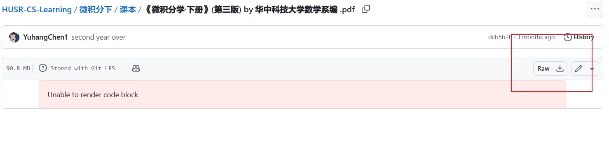

# 如何使用

目前维护者和提供者有限，处于一个多方质疑的状态，本人是理工男不懂更加人性化的设计方案，目前的思路是：

|学院    |课程内容                                          |
|-------------|-------------------------------------------------|
|通识课程|[微积分，大学物理，线性代数等](./通识课程/index.md)|
|计算机学院|[C语言程序设计等](./计算机学院/index.md)|
<!-- |数据结构与算法 |[Coursera: Algorithms I & II](数据结构与算法/Algo.md)|
|软件工程      |[MIT 6.031: Software Construction](软件工程/6031.md)|
|全栈开发      |[MIT web development course](Web开发/mitweb.md)|
|计算机系统导论 |[CMU CS15213: CSAPP](计算机系统基础/CSAPP.md)|
|体系结构入门   |[Coursera: Nand2Tetris](./体系结构/N2T.md)       |
|体系结构进阶   |[CS61C: Great Ideas in Computer Architecture](./体系结构/CS61C.md)|
|数据库原理     |[CMU 15-445: Introduction to Database System](数据库系统/15445.md)|
|计算机网络     |[Computer Networking: A Top-Down Approach](./计算机网络/topdown.md)|
|人工智能      |[Harvard CS50: Introduction to AI with Python](人工智能/CS50.md)|
|深度学习      |[Coursera: Deep Learning](深度学习/CS230.md)| -->

## 如何获取

请给每一个资料链接对象的仓库一个小小的 ⭐ **star** ⭐
目前，几乎所有的资料依托于github和网盘，网盘资料大家都会下载，说明一下github下载方式，点击链接后会导航到拥有该资料的仓库（**若有不愿意链接的请联系我的邮箱:2663767199@qq.com进行撤销，特别声明链接是因为仓库的开源协议，如果反对完全可以理解**），点击下方所示下载图标，即可下载内容，**请随手个进入的仓库一个⭐**
<figure markdown>
  { width="500" }
</figure>

<!-- ## 心有所属

如果你对于计算机领域的核心专业课都掌握得相当扎实，而且已经确定了自己的工作或研究方向，那么书中还有很多未在 [一份仅供参考的CS学习规划](./CS学习规划.md) 提到的课程供你探索。

随着贡献者的不断增多，左侧的目录中将不断增加新的分支，例如 **机器学习进阶** 和 **机器学习系统**。并且同一个分支下都有若干同类型课程，它们来自不同的学校，有着不同的侧重点和课程实验，例如 **操作系统** 分支下就包含了麻省理工、伯克利、南京大学还有哈工大四所学校的课程。如果你想深耕一个领域，那么学习这些同类的课程会给你不同的视角来看待类似的知识。同时，本书作者还计划联系一些相关领域的科研工作者来分享某个细分领域的科研学习路径，让 CS自学指南 在追求广度的同时，实现深度上的提高。

如果你想贡献这方面的内容，欢迎和作者邮件联系 [zhongyinmin@pku.edu.cn](mailto:zhongyinmin@pku.edu.cn) -->
